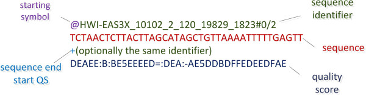

- [**English version**](#NASeqTool)
- [**Русская версия**](#NASeqTool_)
  
# NASeqTool


**NASeqTool** is a bioinformatics tool  for analyzing DNA and RNA sequences.

The repository consists of a main script and additional modules that are used for DNA/RNA sequence processing and sequencing data processing. The scripts are written in the Python programming language.

## Installation

Clone the repository to a local device.

```sh
git clone git@github.com:Valeriisht/NASeqTool.git
```

## Content

The repository structure is structured as the main folder with the master NASeqTool script, where the basic functions are declared, and the subfolder functions with imported modules.


The utility was designed to run on Python version 3.10 or newer.

- ### NASeqTool
    - [**run_dna_rna_tools**](#run_dna_rna_tools)
    - [**filter_fastq_tool**](#filter_fastq_tool)

## run_dna_rna_tools

A utility for manipulating DNA/RNA molecules. The run_dna_rna_tool_module.py module is loaded when the script is executed.


### Usage
You will need:

- DNA/RNA sequences are list (or string when performing an operation on a single sequence), which are required parameters for function calls.


### The utility can perform the following operations: 

- ### Function ```transcribe```.

The meaningful DNA sequence is translated into an mRNA molecule. If RNA is passed as input, the sequence is returned unchanged.

- ### Function ```reverse```

Returns the complementary DNA strand in the 3' to 5' direction. For an RNA molecule, cDNA is returned.

- ### Function ```reverse_complement```

Returns the complementary DNA/cDNA strand in the 5' to 3' direction.

- ### Function ```gc_content```

Counts the GC composition of the sequence and returns the percentage of GC nucleotides.

- ### Function ```is_na_sequence```.

Checks whether the sequence is DNA or RNA.

- ### Function ```length_cds```

Determines the length of the CDS coding sequence.

## filter_fastq_tool

The utility for analyzing sequencing data in fastq format. The filter_fastq_module.py module is loaded when the script is executed.

### Usage

You will need:

- File in fastq format.

Example fastq file structure:



### The utility performs the steps below:

- Filtering the sequence with regard to gc_composition. The gc- composition is counted and determines if the value is within the thresholds.
By default, the threshold values are defined from 0 to 100.

- Filtering the sequence with regard to length. Checks whether the length of the sequence is within the specified threshold values.
By default, the threshold values are defined from 0 to 2**32.

- Sequence filtering with respect to sequence quality. Checks whether the quality on the phred33 scale is within the specified threshold values. The sequence quality is translated from phred33 scale to ASCII.
By default, the threshold value is 0.

The result of the program is an output_file containing only those reads that have passed each of the three filters.

# NASeqTool_


**NASeqTool** биоинформатическая утилита для обработки последовательностей ДНК и РНК.

Репозиторий состоит из главного скрипта и дополнительных модулей, которые используются для обработки последовательностей ДНК/РНК и обработки данных секвенирования. 
Скрипты написаны на языке программирования Python. 


## Установка

Клонируйте репозиторий на локальное устройство.

```sh
git clone git@github.com:Valeriisht/NASeqTool.git
```


## Содержание 

Структура репозитория имеет следующий вид: корневая папка с главным скриптом NASeqTool, где объявлены основные функции, и подпапка functions с импортируемыми модулями.


Утилита была разработана для работы на версии Python3.10 или новее.


- ### NASeqTool
    - [**run_dna_rna_tools**](#run_dna_rna_tools_)
    - [**filter_fastq_tool**](#filter_fastq_tool_)

      


## run_dna_rna_tools_

Утилита для манипуляции с молекулами ДНК/РНК. При исполнении скрипта подгружается модуль run_dna_rna_tool_module.py.


### Использование
Вам понадобятся:

- Последовательности ДНК/РНК, организованные в список (или в строку при выполнении операции над одной последовательностью), которые являются обязательными параметрами для вызова функций.


### Утилита может выполнять следующие операции: 

- ### Функция ```transcribe ```

Смысловая последовательность ДНК переводится в молекулу мРНК. Если на вход передана РНК, возвращается последовательность без изменений.

- ### Функция ```reverse```

Возвращает комплементарную цепь ДНК в направлении от 3' к 5'. Для молекулы РНК возвращается кДНК.

- ### Функция ```reverse_complement```

Возвращает комплементарную цепь ДНК/кДНК в направлении от 5' к 3'.

- ### Функция ```gc_content```

Подсчитывается GC-состав последовательности и возвращается процент GC-нуклеотидов.

- ### Функция ```is_na_sequence```

Проверяется, является ли последовательность ДНК или РНК.

- ### Функция ```length_cds```

Определяется длина кодирующей последовательности CDS.

## filter_fastq_tool_

Утилита для обработки данных секвенирования в формате fastq. При исполнении скрипта подгружается модуль filter_fastq_module.py.

### Использование

Вам понадобятся:

- Файл в формате fastq.

Пример структуры fastq файла:


### Утилита выполняет следующие действия:

- Фильтрация последовательности относительно gc_состава. Подсчитывается gc-состав и определяется, находится ли значение в пределах пороговых.
По умолчанию пороговые значения определены от 0 до 100.

- Фильтрация последовательности относительно длины. Проверяется, находится ли длина рида в пределах заданных пороговых значений.
По умолчанию пороговые значения определены от 0 до 2**32.

- Фильтрация последовательности относительно качества рида. Проверяется, соответствует ли качество рида по шкале phred33 заданным пороговому значению. Качество рида переводится из шкалы Phred33 в ASCII.
По умолчанию пороговое значение равняется 0.

Результатом работы программы является output_file, содержащий только те риды, прошедших каждую из трех фильтраций.


